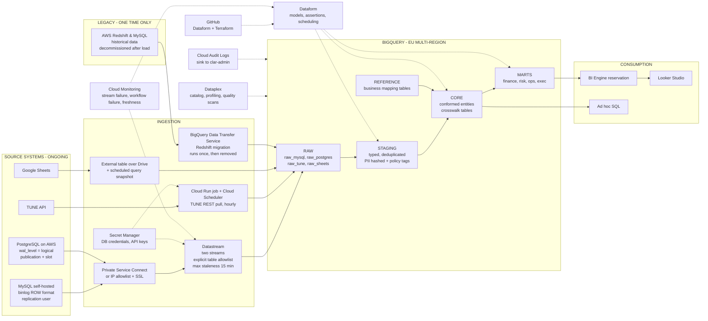
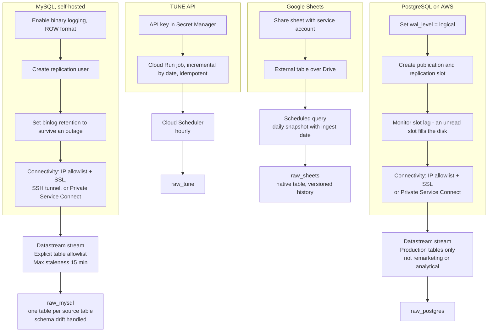
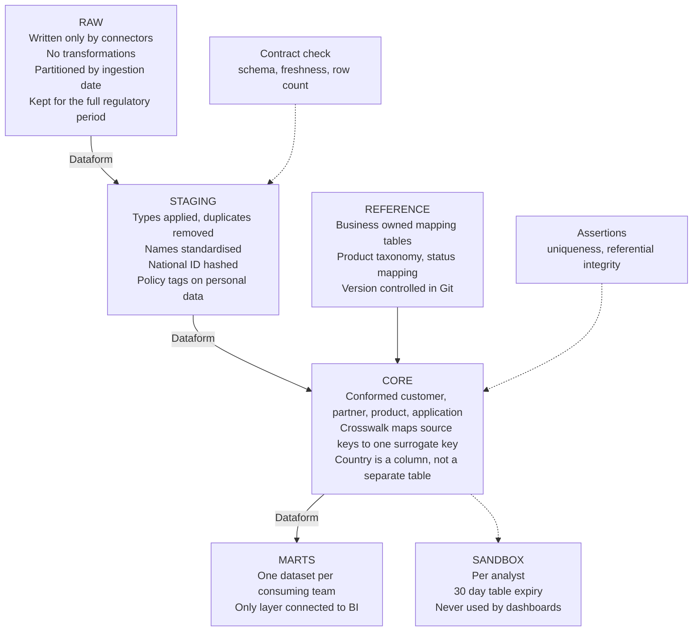
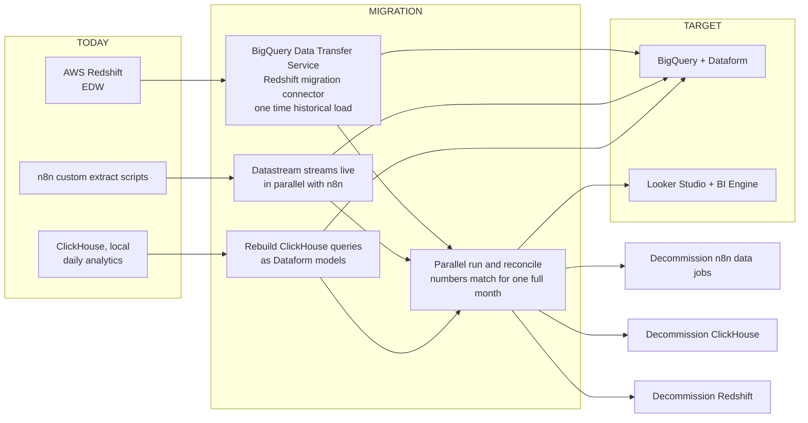

# Data platform architecture proposal

## Contents

- [1. Target platform](#1-target-platform)
- [2. Ingestion prerequisites](#2-ingestion-prerequisites)
- [3. Layers inside BigQuery](#3-layers-inside-bigquery)
- [4. Migration and decommission](#4-migration-and-decommission)
- [Connector map](#connector-map)
- [Open decisions](#open-decisions)

---

## 1. Target platform

Every component needed for a working platform, not only the data path.
Solid lines carry data; dotted lines are services that act on the platform.

Two AWS-hosted systems appear here and they are not the same job:

- **PostgreSQL on AWS** is a live lending database, replicated continuously by Datastream.
- **AWS Redshift** is the current warehouse. Its history is copied once by the BigQuery Data Transfer Service, then Redshift is decommissioned.

---

## 2. Ingestion prerequisites

What must be true on each source before the connector will run.
These prerequisites, not the connector configuration, are the real work of the ingestion phase.

---

## 3. Layers inside BigQuery

Access follows the layers: `raw` is the data team and service accounts only, `core` adds analysts,
`marts` is the only layer BI connects to. Nothing outside the platform reads `raw` or `stg`.

---

## 4. Migration and decommission

Nothing is switched off until the numbers match for a full month, including a month-end close.

---

## Connector map

| Source | Tool | Mechanism | Frequency |
|---|---|---|---|
| MySQL, self-hosted | Datastream | Reads the binary log, serverless CDC | Continuous, staleness configurable |
| PostgreSQL on AWS | Datastream | Logical replication slot | Continuous, staleness configurable |
| Google Sheets | BigQuery external table over Drive | Queried in place, snapshotted to a native table | Daily snapshot |
| TUNE API | Cloud Run job + Cloud Scheduler | REST pull, incremental by date | Hourly |
| AWS Redshift | BigQuery Data Transfer Service | Purpose-built migration connector | Once |
| Google Ads *(future)* | BigQuery Data Transfer Service | First-party connector, no orchestration charge | Daily |

No table is ingested by more than one mechanism. Adding a table to a Datastream stream is a
deliberate change, not a wildcard — see the cost note below.

---

## Open decisions

| Decision | Why it is open | How to close it |
|---|---|---|
| Datastream cost | CDC is priced per GiB processed, and a processed byte is 2–5× the source data. Streaming everything would cost several times the warehouse itself. | Measure change volume: `SHOW BINARY LOGS` on MySQL, WAL generation on PostgreSQL, for one week. |
| Datastream vs DTS for the databases | The DTS MySQL and PostgreSQL connectors are priced in slot-hours rather than per GiB, which is an order of magnitude cheaper — but batch does not capture hard deletes. | Evaluate delete handling and watermark requirements against the measured volume. |
| Database connectivity | Datastream must reach a self-hosted MySQL host and an AWS-hosted PostgreSQL. | Choose between IP allowlist with SSL, SSH tunnel, and Private Service Connect. Only the last needs a VPC. |
| dbt vs Dataform | Both work. Dataform needs no infrastructure and brings its own scheduler; dbt has the larger talent pool. | Decide before the first model is written. |

### Tables that should not be replicated

- The 3.5 TB of MySQL log tables — no dashboard reads them, and they would dominate the Datastream bill.
- The PostgreSQL remarketing (0.7 TB) and analytical (0.75 TB) databases — these are already derived
  data. Rebuild them as Dataform models on top of the production tables rather than paying to move them.

---

## Editing these diagrams

The Mermaid blocks above are the source of truth. To preview a change before committing, paste the
block into [mermaid.live](https://mermaid.live). To use the diagrams elsewhere:

- **Confluence** — a draw.io macro will import Mermaid via Arrange → Insert → Advanced → Mermaid.
- **Slides** — export SVG or PNG from mermaid.live.
- **Locally** — `npx @mermaid-js/mermaid-cli -i ARCHITECTURE.md -o out.md` renders every block to images.
