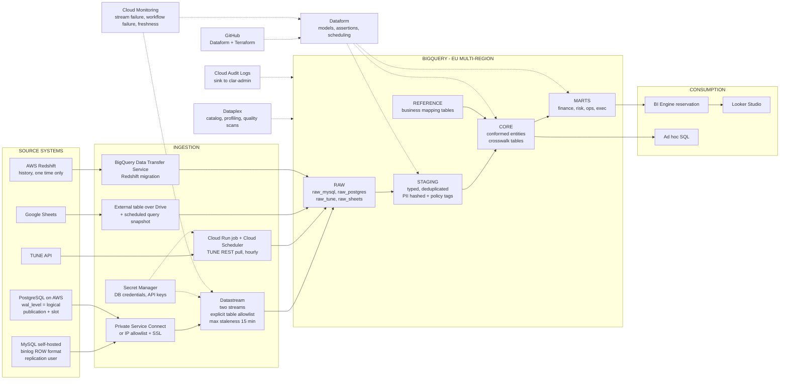
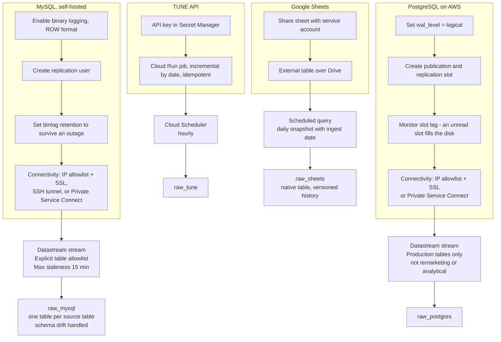
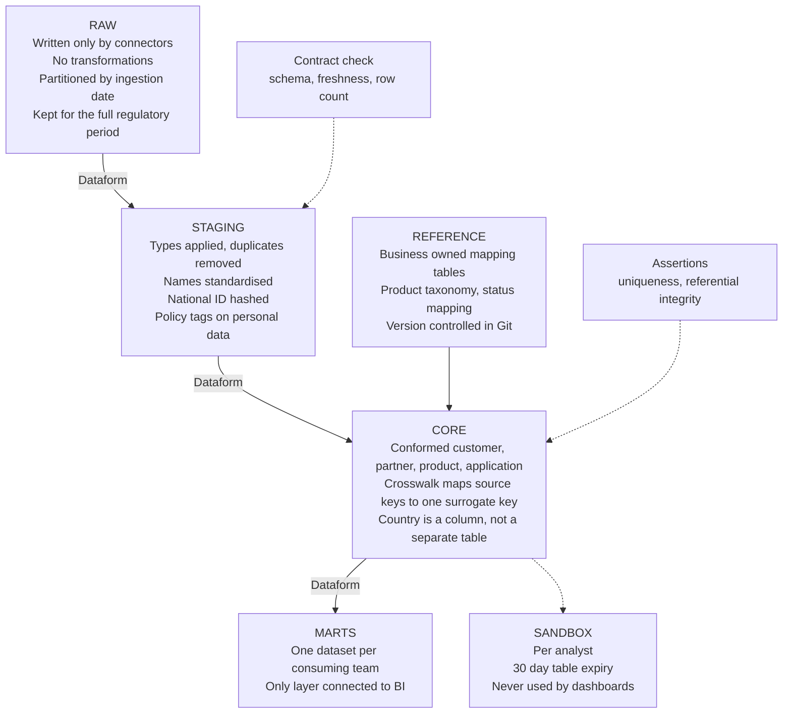
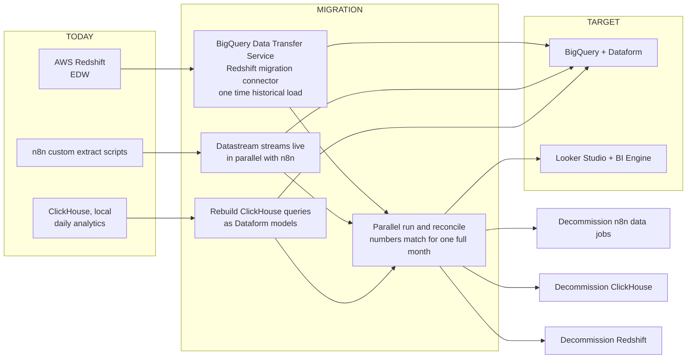

# Clar Data Platform — TO-BE architecture diagrams (Mermaid)

---

## 1. Target platform — Datastream committed

Every component needed for a working platform, not only the data path.
Solid lines carry data. Dotted lines are services that act on the platform.

---

## 2. Ingestion detail — prerequisites per source

---

## 3. Layers inside BigQuery

---

## 4. Migration and decommission

